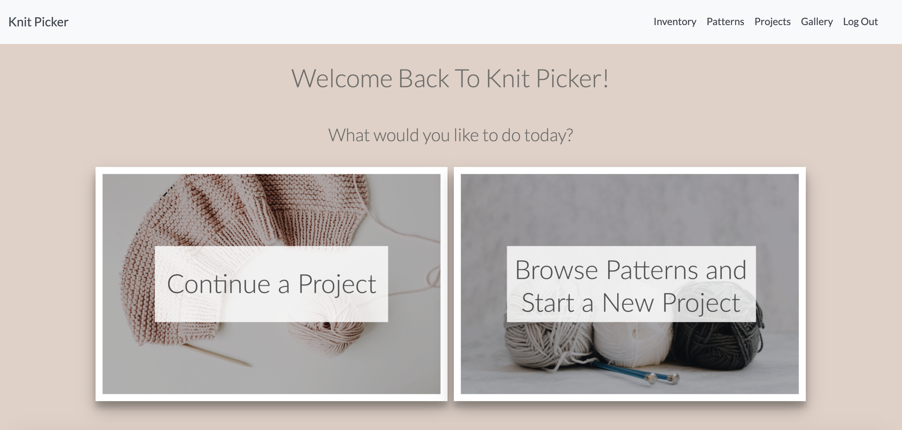
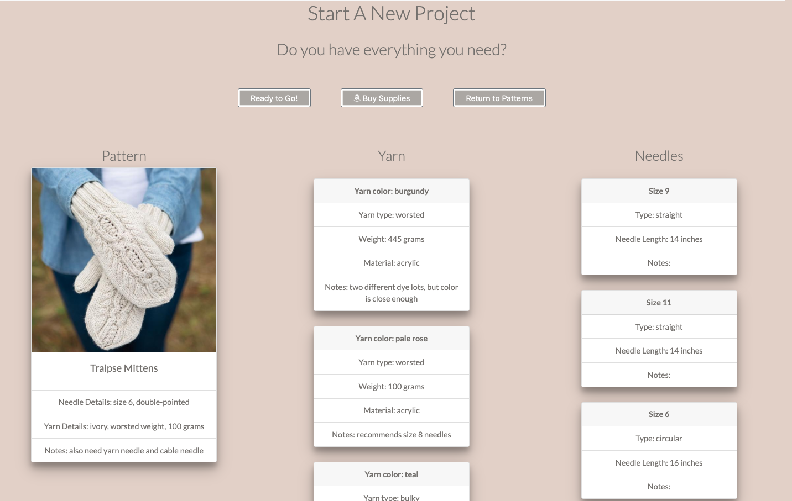
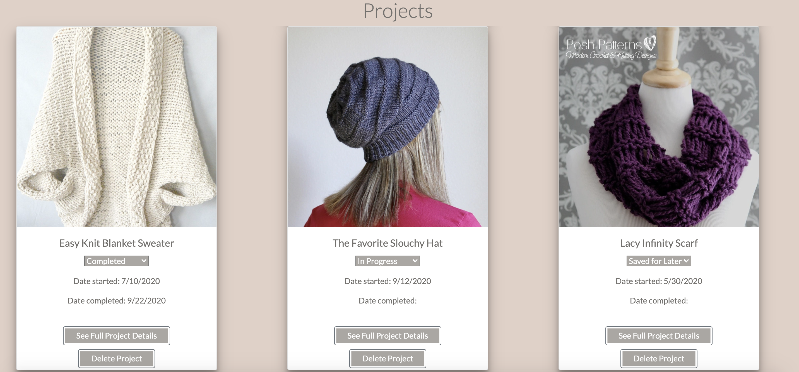
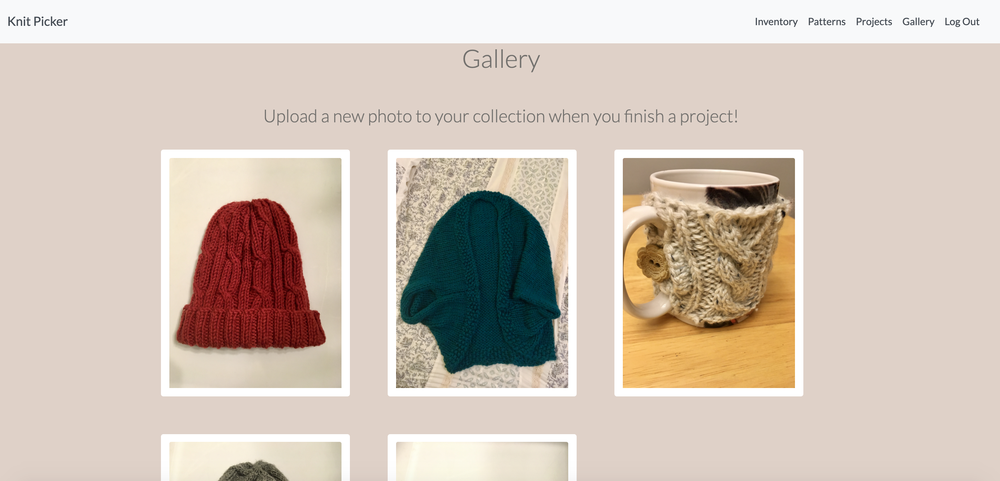

# Knit Picker 🧶

## Description
This is my frontend capstone for Nashville Software School's Evening 12 Cohort! It's built with React and uses a Google Firebase database. It allows users to keep track of their knitting supplies, save patterns, easily compare their materials against pattern requirements when they decide to start knitting a pattern, keep track of knitting projects together in one place, and upload photos of finished projects to a gallery where they can see everything on disply.

### Feature List
* Built using React 
* React routing for navigation
* Google authentication and data unique to each user
* Full CRUD throughout the app
* Google Firebase hosting
* File uploading and storage through Firebase

### How To Run
1. Clone the repo to have it on your local machine
1. Install dependencies
1. Use `npm start` to start up a local server
1. Visit the server in your browser (defaults to http://localhost:3000/)
1. Visit the deployed site at https://knit-picker.web.app/

### Screenshots

### Contributors
* [Jeanine Beckle](https://github.com/jeaninebeckle)

### TODO
* Automate features of the app. Examples: comparing owned supplies against pattern requirements or having the yarn inventory weight decrease upon project completion.
